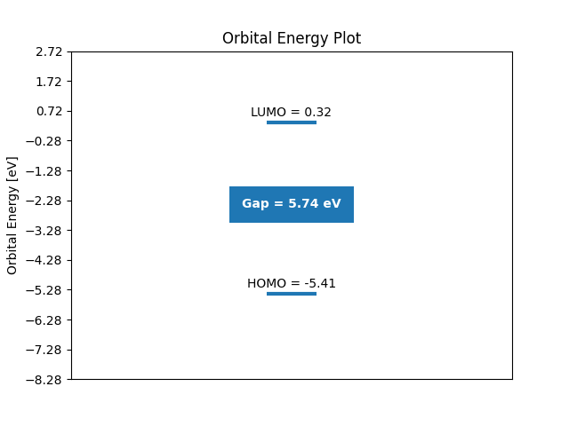

# HOMO-LUMO

This is a python program that when given a Gaussian 16 output file (.log), will plot the HOMO and LUMO energies, as well as the HOMO-LUMO gap, in units of eV, using Matplotlib. These energies will also be outputted to the terminal once Matplotlib has been closed.

Usage: py orbs.py <name_of_file_without_extension>

Package Requirements: Matplotlib, NumPy

Here is an example output:
